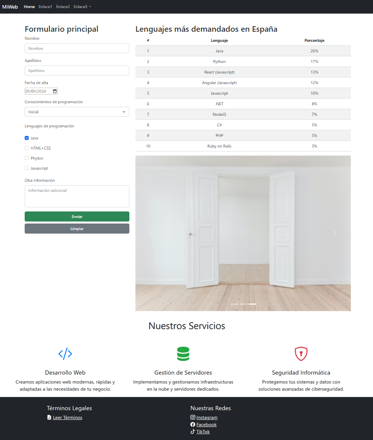

# Práctica 4.6 Página web en Bootstrap

El **objetivo** de esta práctica es diseñar y maquetar una página web completa utilizando Bootstrap, practicando con diversos de sus componentes, el sistema de rejilla (grid system) y utilidades (utilities), así como prácticas de diseño responsive. 

Esta práctica sirve para encaminar la entrega del **segundo proyecto trimestral** evaluable del módulo de Desarrollo de Interfaces.

## Parte 1

La **temática** de la web será libre, pero deberá ser propia y coherente con todos sus elementos añadidos (colores, iconos, textos, imágenes y estructura).

Deberá de incluir al menos los siguientes elementos:

#### 1. Barra de navegación
- Una **barra de navegación** o *navbar* de Bootstrap.
- Deberá de contener al menos:
    - Inclusión de un logo o título representativo de la temática
    - Varios enlaces de navegación.
    - Al menos un menú desplegable (*dropdown*).

#### 2. Diseño general
- Utilizar un lenguaje de diseño coherente con lo que hemos visto hasta ahora:
    - Colores, tipografías y estilos acordes a la temática elegida.
    - Uso adecuado de clases Bootstrap y jerarquía visual.
- Se deberá incluir una hoja de estilos CSS adicional donde se modifiquen:
    - Ciertos componentes o colores personalizados.
    - Espaciados, bordes, sombras u otros ajustes visuales.

#### 3. Contenedor principal (container)

Dentro del contenedor principal de la página, incluir los siguientes elementos: 

#### a) Tabla de datos
- Una tabla formateada con Bootstrap (`table`, `table-striped`, `table-hover`, etc.).
- Debe contener al menos **10 filas de datos**.
- El contenido:
  - Será contenido **estático** para esta práctica.
  - Deberá estar relacionado con la temática de la web.
  - *Nota:* Esta tabla se mejorará en prácticas posteriores obteniendo los datos desde una *API externa*.

#### b) Carrusel o galería de imágenes
- Un **carrusel de Bootstrap** o galería similar con controles o transiciones.
- Las imágenes:
  - Pueden ser generadas de forma aleatoria desde servicios como *Lorem Picsum* o similares tal y como hicimos en prácticas anteriores.
  - Deberán tener un tamaño coherente y uniforme.

#### c) Footer
- Incluye un **footer** al final de la página utilizando componentes de Bootstrap.
- Debe contener, al menos:
  - Información básica (autor, curso, nombre de la web o copyright).
  - Enlaces secundarios o iconos a redes sociales (reales o ficticios).
  - Mantener la coherencia visual y uso de rejilla con el resto de la página.

#### d) Componentes adicionales y valorables
Añade varios de los siguientes componentes *Bootstrap* valorables que tengan sentido dentro de tu web, por ejemplo:
- Cards
- Alerts
- Badges
- List groups
- Breadcrumbs
- Modales
- Tooltips o popovers

## Parte 2

A partir de la página creada en la Parte 1, realiza las siguientes mejoras:

#### 1. Contenedor en dos columnas
- El contenedor principal pasará a tener **al menos dos columnas**.
- Deberá de diseñarse el siguiente comportamiento **responsive**:
    - En pantallas **extra grandes (XL)** se mostrará en tres columnas, una de ellas actuará como **sidebar** y solo será visible en este tamaño de pantalla.
    - En pantallas **medianas y grandes (MD y LG)** el diseño se adaptará a dos columnas.
    - En pantallas **pequeñas (SM y XS)** el contenido se mostrará en una única columna.

#### 2. Sección de tres columnas
- Una fila final con **tres columnas** que describan:
  - Servicios
  - Características
  - Funcionalidades
- Cada columna deberá incluir:
  - Un **icono** (por ejemplo, usando *Bootstrap Icons*).
  - Un **título**.
  - Una **breve descripción** relacionada con la temática.

#### 3. Formulario principal
En una de las columnas incluye un **formulario completo** que contenga:

- **Al menos 6 elementos de formulario**, por ejemplo:
  - Campos de texto (`input text`, `email`, `password`…)
  - Selectores (`select`)
  - Checkboxes o radio buttons
  - Textarea
  - Botón de envío
- Todos los campos deben estar **correctamente etiquetados** (`label`)

## Valoración y testing

Para la evaluación de la práctica se tendrá en cuenta:

- Uso correcto y variado de **componentes Bootstrap** obligatorios y los opcionales.
- Aplicación adecuada del **sistema de rejilla y diseño responsive**.
- Coherencia estética y visual con la **temática elegida**
- Claridad y organización del código *HTML* y *CSS*.
- Inclusión de títulos o descripciones en las diapositivas o galerías avanzadas.
- Inclusión de una **tabla de pruebas** donde se documenten:
  - Casos de validación del formulario.
  - Campos correctos e incorrectos.
  - Resultado esperado y resultado obtenido.
- **Documentación** de la web en formato *markdown* con capturas de la web y su funcionamiento.
