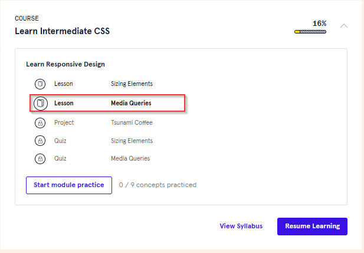
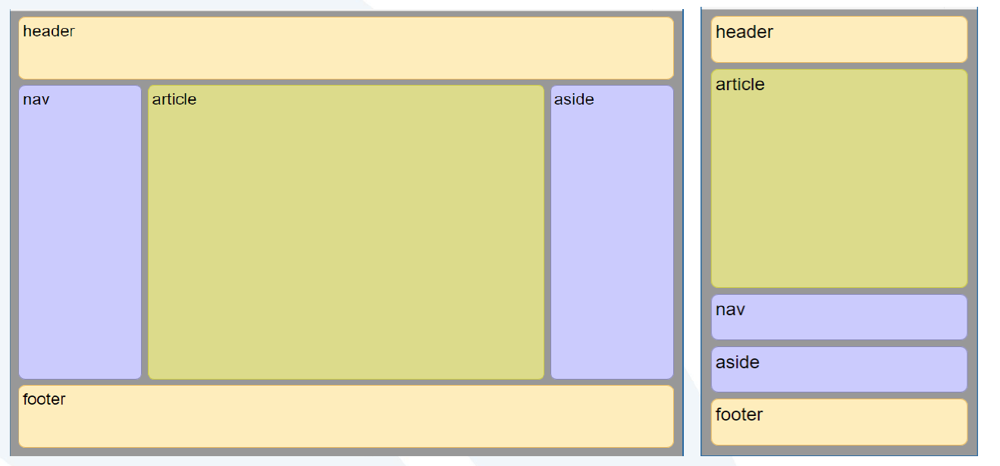
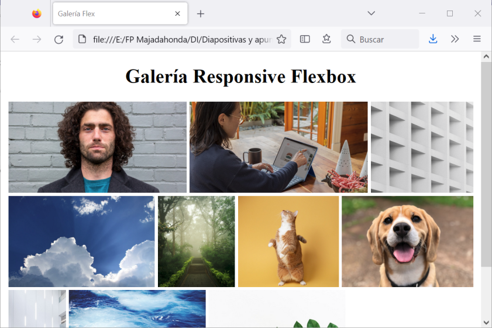

# Práctica 4.6 CSS Flexbox

## Parte 1

Finaliza el tutorial **Media Queries** de **Codecademy** de la parte de *Learn intermediate CSS.*   

Captura la finalización de dicho módulo desde tu cuenta en el que se aprecie que estás logueado. 

## Parte 2

Crea un diseño mediante Flexbox para conseguir que una página con **3 columnas** que se adapte con el estilo similar al de la captura.   

Permitir el **cambio adaptativo** a una sola columna para dispositivos de menos de **640px**.

## Parte 3

Crea una página que contenga una **galería** con al menos 6 imágenes y el código CSS necesario que permita adaptarse al menos a **3 dispositivos** y que utilice varias de las propiedades flexbox vistas en clase (*align, justify, order, etc.)*
-   Pantalla panorámica
-   Escritorio
-   Tableta
-   Móvil

